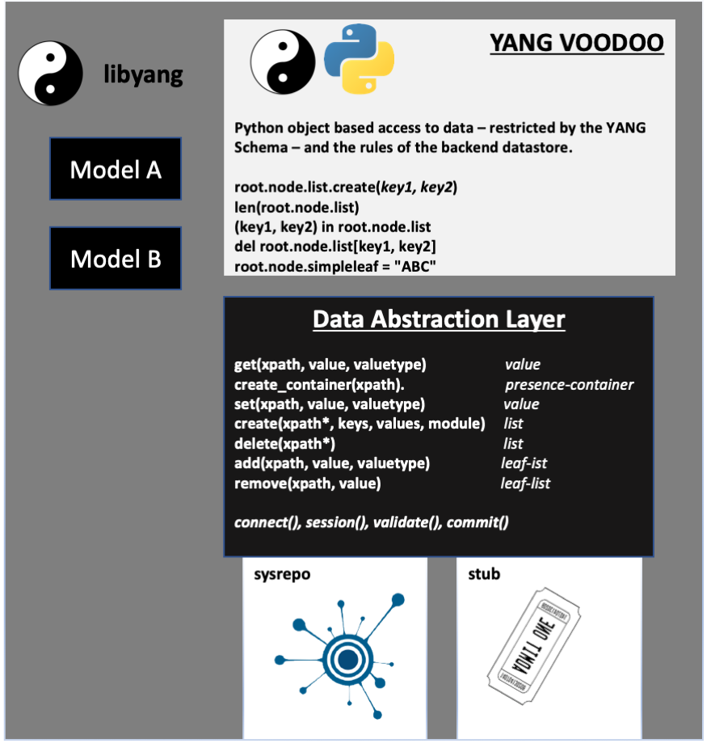

# Python access to YANG based Datastore (based on libyang1)

[](https://travis-ci.org/allena29/python-yang-voodoo)
[]

The aim of this project is to provide the ability to write python code where there is a strong YANG based data model.
By providing an object based access layer it allows data to be traversed without worrying about lower level details, and
allow a stronger focus on getting the 'value add' correct.

This is a **proof of concept** project.

To see screencasts demonstrating the concepts see:

 - [36 second spinning up docker](https://asciinema.org/a/246485) - uses this [yang model](https://raw.githubusercontent.com/allena29/python-yang-voodoo/master/yang/integrationtest.yang) and [initial data](https://raw.githubusercontent.com/allena29/python-yang-voodoo/master/init-data/integrationtest__webdata.xml)
 - [12min showing details usage](https://asciinema.org/a/246248)

A powerpoint slide:

[https://app.box.com/s/lzwmumytlbbo83eew0etcpq6qtqjmywl](https://app.box.com/s/lzwmumytlbbo83eew0etcpq6qtqjmywl)


Taking the very basic yang module below, we can imagine how it might look in a few different ways.

```
container bronze {
  container silver {
    container gold {
      container platinum {
        leaf deep {
          type string;
        }
      }
    }
  }
}
```


This project builds upon [Libyang](https://github.com/CESNET/libyang) to tightly couple the data model to a set of standard yang models.
In the early project sysrepo was used to provide a persistent data-store - however an in-memory libyang data-tree was favoured instead of
tightly coupling into a persistent datastore.


```python
root.bronze.silver.gold.platinum.deep = 'DOWN'
print(root.bronze.silver.gold.platinum.deep)
```


This can be expressed as XML

```xml
  <bronze>
    <silver>
      <gold>
        <platinum>
          <deep>DOWN</deep>
        </platinum>
      </gold>
    </silver>
  </bronze>
```

 Or json

 ```json
  {
    "bronze" : {
      "silver": {
        "gold": {
          "platinum": {
            "deep": "down"
          }
        }
      }
    }
  }
 ```


# Overall Structure





## Abstraction of Data Access

The original project started by abstracting the datastore, however only the libyang stub based datastore remains.

Implementing a new data_abastraction_layer is as simple as implementing the following methods.

 - **connect(module, yang_location, tag, yang_ctx)** - connects to the datastore, it is expected that the datastore may provide and track a specific connection providing *transactionality*.
   - module - mandatory argument, the yang module.
   - yang_location - a directory providing the location of the yang files, or None to YANGDIR environemnt variable.
   - tag - cosmetic tag.
   - yang_ctx - optional - if wanting to use libyang based diff engine both data objects must have the same libyang_ctx.
 - **validate()** - validate pending changes are valid based on the full data of the entire datastore (VoodooNode is limited to validating the yang schema itself).
 - **refresh()** - refresh the data from the datastore, the datastore may provide us with the data present in the datastore at the time we first connected, or it may refresh in realtime everytime we access a given set of data.
 - **commit()** - commit pending datastore.
 - **disconnect()** - disconnect from the datastore
 - **is_session_dirty()** - indicates we have made changes
 - **has_datastore_changed()** - indicates changes have been made to the datastore from a different transaction.
 - **container(xpath)** - returns True/False if the presence-container exists.
 - **get(xpath, default_value)** - get specific data by XPATH, this will not apply to non-presence containers or lists
 - **gets_unsorted(xpath, schema_path, ignore_empty_lists)** - get a list of XPATH's representing the items in the list, it is expected the datastore will maintain the order the user inserts the data and this MUST return the data in that order. If the list is empty this method will normally raise an ListDoesNotContainElement exception.
 - *TO BE DEPRECATED* : **gets_sorted(xpath, schema_path, ignore_empty_lists)** - as gets_unsorted, but the results will be sorted by XPATH.
 - **gets_len(xpath)** - gets back number of list elements available in the list (Not for leaf-lists)
 - **gets(xpath)** - gets a generator back of values for a specific XPATH (leaf lists only)
 - **add(xpath, value, valuetype)** - add a new entry to the end of a leaf-list at the given XPATH
 - **remove(xpath, value)** - remvoes an entry from a leaf-list at the given XPATH - the XPATH given is the XPATH to the leaf-list itself, not the specific item.
 - **has_item(xpath)**- returns True if the item has been populated with data.
 - **create(xpath, key_tuple, value_tuple)** - create a list item, to remove use **uncreate**
 - **uncreate(xpath** - delete a list element from the datastore.
 - **create_container(xpath)** - if a container is a presence container explicitly create the container.
 - **set(xpath, value, valuetype, nodetype)** - sets the value of a specific xpath (supported for yang leaves).
   - The valuetype is an integer (matching libyang, see  Types.py/DATA_ABSTRACTION_MAPPING). This is based on the effective type of the yang field (*based on fuzzy matching in the case of unions*). Defaults to 10 for a string.
   - The nodetype is an integer (matching libyang) and defaults to 4 for a leaf, 16 for a list - 100 is a special value for presence containers.
 - **delete(xpath** - delete a value or container, this method must not be used for lists.
 - **empty()** - a dangerous option which will remove everything from the datastore.


## JSON/XML Import/Export

In the first versions of this project the JSON/XML documents were rendered in a sub-optimal
way. Now the data-access has methods to import and export data - currently only the libyang
based stub module has support for these methods.

 - **load(filename, format)** - load the XML (format=1) or JSON (format=2) document corresponding
   to the yang module loaded
 - **dump(filename, format)** - save the data to an XML (format=1) or JSON (format=2) document.
 - **loads(payload, format)** - load the XML (format=1) or JSON (format=2) document corresponding
   to the yang module loaded from the payload string provided.
 - **dumps(format)** - return the data to an XML (format=1) or JSON (format=2) document
 - **merges(payload, format)** - merge the data from the XML (format=1) or JSON (format=2) document
   corresponding to the yang module loaded from the payload string provided into the existing data.
   *Note: the existing data tree must have data in place.*


### SCHEMA vs DATA level constraints

There are some validation and constraints that are schema level, that is they are defined in the yang model and have no dependency on the data in the datastore. ~~Schema based constraints are enforced by libyang without a requirement to run a full datastore (like sysrepo).~~ Note: sysrepo actually calls libyang to perform the validation with the full dataset.

Examples of schema based constraints.

 - Creating/accessing nodes that are not part of the YANG model.
 - Setting data that does not match they type (i.e. string, uintX, intX, boolean)


Data level constraints need to be supported by the backend datastore, and this is true of sysrepo.

 - Validating enumerations
 - Validating must and when expressions
 - Validating data matches the path of a leafref.


## Example Docker instance

See below for for instructions setting up without docker.

The following (amd64) docker image can be used `docker pull allena29/yabgvoodoo:devel`

```bash
git pull allena29/yangvoodoo:devel
docker run -i  -t allena29/yangvoodoo:devel /bin/bash

# inside docker container
cd /working
git pull
sysrepod -d -l 2
sysrepo-plugind

## Install YANG & Initialise startup configuration

cd /working/yang
./install-yang.sh
cd /working/init-data
./init-xml.sh
```

The `./launch-dbg` script in this repository will build a docker image (*first time will be slower*) mounts the current directory (i.e. this repository) as `/working` and then runs `/working-start-in-docker.sh`. This gives a quick way of getting a fresh docker instace (after the first build - which will terminate at the end). This will launch into an interactive python session (CTRL+D) to exit to bash.


# Tests

- **unitcore** Unit tests (against stub) for voodoo node based access
- **unit** Unit tests (against stub) for extended test cases
- In addition to tests *pycodestyle* and *xenon* are used for linting and complexity checks.


All tests can be executed with

```bash
./run-tests.sh
```

Integration tests can be skipped with

```bash
./run-tests.sh unit
```


# Sysrepo Datastore


See [Details Sysrepo Documentation](Documentation/Datastores.md)


# Object based python access

This is a proof of concept style quality of code at this stage.

- We allow libyang to constrain our schema, however this means some things will be **invalid** but not fail basic schema checks which libyang gives us as part of it's validations.
- Then `session.commit()` which wraps around sysrepo's commit will actually validate things like must, whens and leaf-ref pathss.


When running `connect()` the directory `yang` will be used to find the respective yang modules. There is a 1:1 mapping between a root object and yang module - this fits with the pattern of sysrepo.


```python
import yangvoodoo
session = yangvoodoo.DataAccess()
session.connect('integrationtest', yang_location='yang')
root = session.get_node(readonly=False)

# Set a value
root.simpleleaf = 'abc'

# Delete of a leaf
root.simpleleaf = None

# Access a leaf inside a container
print(root.morecomplex.leaf3)
# or
print(root.morecomplex['leaf3'])

# Create (or return) a list element - this list has two boolean keys
listelement = root.twokeylist.create(True, True)
listelement.tertiary = True

# Access data with square brackets (both these two options are equivalent)
listelement = root.twokeylist[True, True]
listelement = root.twokeylist.get(True, True)

# Iterate around a list
for y in root.twokeylist:
    print("Object Representation:", repr(y))
    print("Leaf from listelement:", y.primary)
    print("Children of listelement:", dir(y))

# Delete list times
del root.twokeylist[True, True]

# Multiple levels
root.bronze.silver.gold.platinum.deep = 'abc'

# Accessing parents (this is root.bronze (use with care - it's intended for interactive debug)
root.bronze.silver._parent

# Get helptext from the YANG node, there are two formats depending on how the data is represnted.
session.decsribe(root.bronze)
session.describe(root,'simpleleaf')

# Return the argument of the extnesion 'info' if it exists on teh child node dirty_secret (otherwise None)
root.get_exension('info', 'dirty_secret')

# A special method on lists allows us to retrieve items sorted by XPATH
# instead of by the order they were added to the datastore.

for gig in root.web.bands['Yuck'].gigs._xpath_sorted:
   print(gig.year, gig.month, gig.day, gig.venue, gig.location)
   # Results in
   #  2010 10 14 Harley Sheffield
   #  2010 10 27 Lexington Islington
   #  2011 11 24 Electric Ballroom Camden
   #  2011 5 18 Scala Kings Cross

# Validate data with libyang.
session.validate()

# Disconnect
session.disconnect()
```


#### Session to YANG

A session maps exactly to one YANG module (including it's child nodes), in terms of the datastore we expect it will manage each module as a separate transactional boundary.

The `SuperRoot` object provides a container for multiple top-level nodes from YANG modules, the transactional boundary remains with the resepective sessions.

```python
import yangvoodoo
root = yangvoodoo.DataAccess.get_node()

session1 = yangvoodoo.DataAccess()
session1.connect("integrationtest")
session2 = yangvoodoo.DataAccess()
session2.connect("secondmodule")

root.attach_node_from_session(session1, 'morecomplex')
root.attach_node_from_session(session1, 'web')
root.attach_node_from_session(session2, 'second')
dir(root)
```


#### Templates

It is possible to apply templates to set data instead of manually setting every element of data individually. [Jinja2](http://jinja.pocoo.org/docs/2.10/) is used to provide the ability to make templates less static.

Templates are only supported on the libyang stub

 - `root._context.dal.loads(<template_string)`
 - `root._context.dal.load(filename)`
 - `root._context.dal.merges(filename)`

It is not possible to use the load/loads operation on a data-tree that already has data, instead the merges
must be used.

By default loads will enforce constraints on the yang model and merges will not, but the operations take a trusted
flag to change this behaviour.

Along with the load/loads methods there are dump/dumps methods.


# Install

[Installing local versions](INSTALL.md)


# TODO LIST

see [TODO LIST](TODO.md)


# Reference:

- [Sysrepo](http://www.sysrepo.org/) - no longer implemented
- [Libyang](https://github.com/CESNET/libyang) 
- [libyang python bindings](https://github.com/allena29/libyang-cffi) - NOTE: this project targets libyang version 1 still.
- [Low level C development notes](DEVEL.md)
